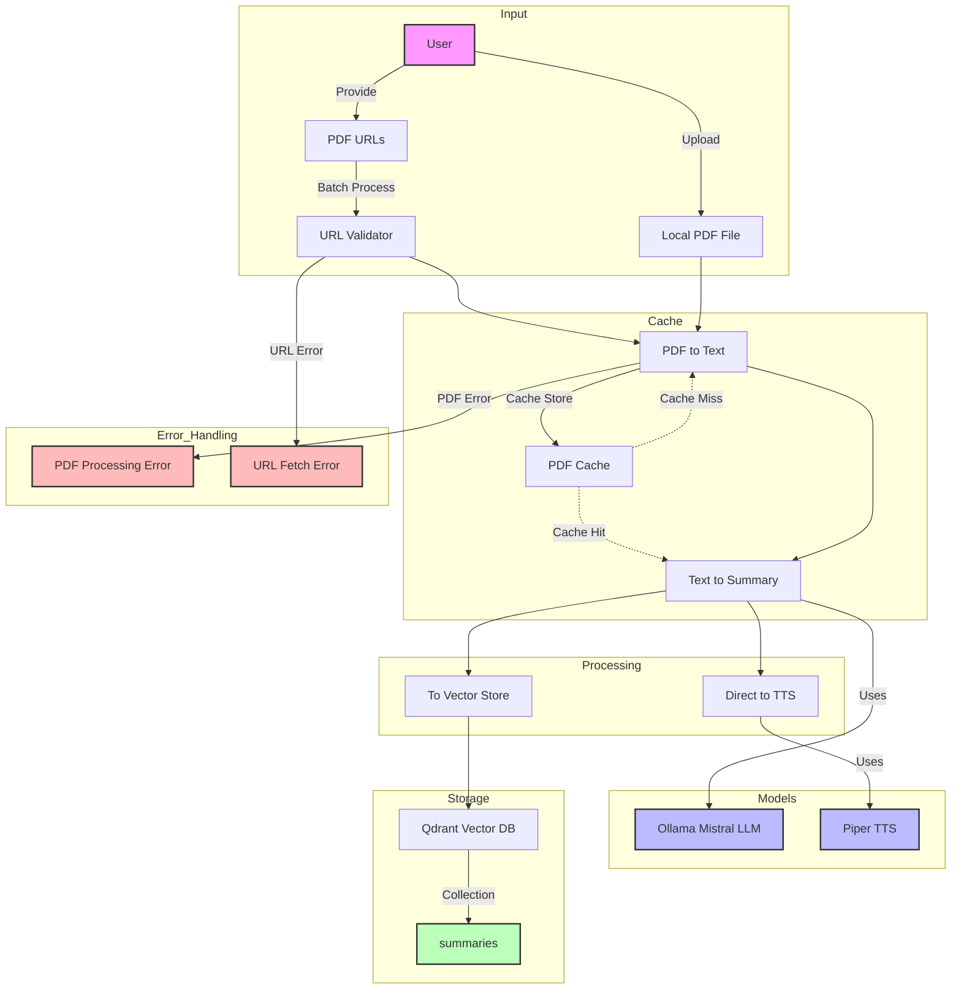

# scribe_cast
Document-to-Dialogue Translator

## Prerequisites
### [Piper](https://github.com/rhasspy/piper)
Piper is a fast local neural Text To Speech (TTS) system. You can download the executable corresponding to your operating system and CPU architecture from [Releases](https://github.com/rhasspy/piper/releases). For an x86_64 Linux machine, you'd run 
```shell-session
$ curl -L -O https://github.com/rhasspy/piper/releases/download/2023.11.14-2/piper_linux_x86_64.tar.gz
$ tar xvzf piper_linux_x86_64.tar.gz # Extract file 
$ cd piper/ # Navigate to extracted file 
$ chmod u+x piper # Set piper mode to executable
$ mkdir models/ # Create a models directory to save voice models and configurations
```
To download [voices](https://github.com/rhasspy/piper/blob/master/VOICES.md)
```shell-session
$ cd models/
$ curl -L -O https://huggingface.co/rhasspy/piper-voices/resolve/v1.0.0/en/en_GB/alba/medium/en_GB-alba-medium.onnx # Download voice model 
$ curl -L -O https://huggingface.co/rhasspy/piper-voices/resolve/v1.0.0/en/en_GB/alba/medium/en_GB-alba-medium.onnx.json # Download model config 
```

Piper is a stand-alone tool that can either output an audio file
```shell-session
# Save speech to file
$ cat my_file.md | ./piper --model models/en_GB-alba-medium.onnx --output_file my_file.wav 
$ # Optionally, convert to .mp3 with ffmpeg
$ ffmpeg -i my_file.wav -vn -ar 44100 -ac 2 -b:a 192k my_file.mp3
```
or stream audio to stdout
```shell-session
# Stream to stdout
$ cat my_file.md | ./piper --model models/en_GB-alba-medium..onnx --output-raw | \
  aplay -r 22050 -f S16_LE -t raw - 
```

### [Podman](https://podman.io/docs/installation)
You'll need to have a container engine installed, should you want to locally install some vector DBs such as Qdrant, Milvus, LanceDB or Weaviate among others.


### VectorDBs

#### [Qdrant](https://qdrant.tech/documentation/quickstart/) 
Qdrant is taking off fast in the vector store world, due to its ease of setup and usage simplicity.  
Pros:  
- Very simple setup
- Excellent TypeScript support
- REST API is straightforward
- Small resource footprint
- LlamaIndex integration    
Cons:  
- No native graph support[^1]

Installing and running Qdrant is simple
```shell-session
$ podman pull qdrant/qdrant
$ podman run -p 6333:6333 qdrant/qdrant
```

#### [MongoDB](https://www.mongodb.com/products/self-managed/community-edition)
Edgar Dijkstra was known for advocating for simplicity _"Simplicity is prerequisite for reliability."_. To avoid unnecessary moving parts in an application, another database solution that offers both graph and vector search is the excellent MongoDB.
Pros:  
- Simple setup
- Familiar for developers
- Graph support via $graphLookup
- LlamaIndex integration  
Cons:  
- Not vector-native
- Lower vector performance


## Architecture
Here's what I've come up with   



[^1]: From [Qdrant docs](https://qdrant.tech/documentation/faq/qdrant-fundamentals/): _"What Qdrant doesn’t plan to support:
    Non-vector-based retrieval or ranking functions
    Built-in ontologies or knowledge graphs
    Query analyzers and other NLP tools"_ 
